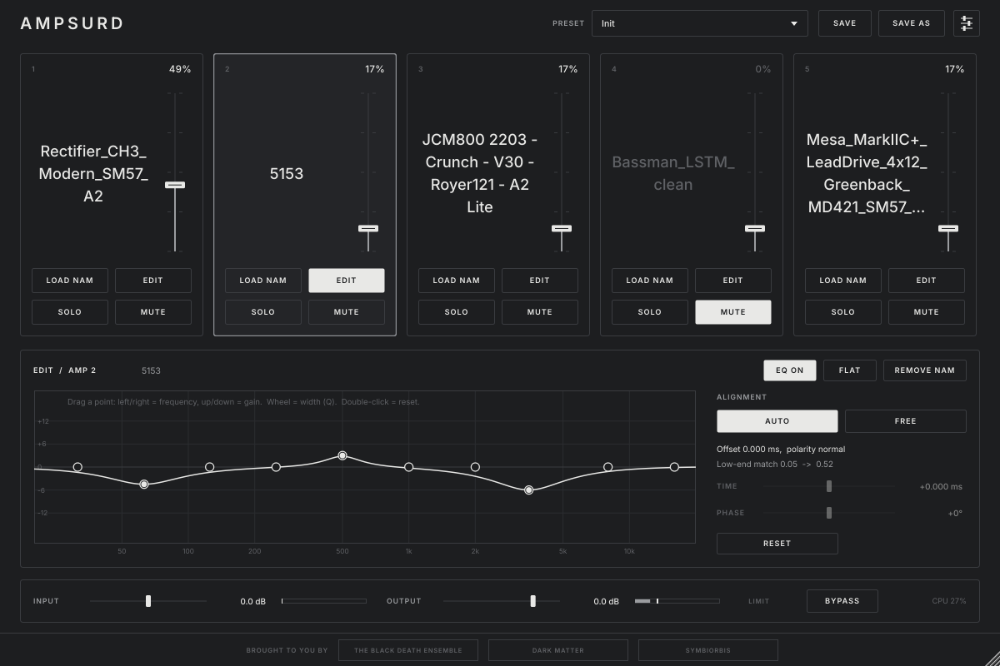

# AMPSURD

Free, open-source guitar plugin: one DI signal → up to **five Neural Amp Modeler captures in
parallel** → blended into one sound. Load up to five NAMs. Blend them. Optional corrective
editing. Play.

- Loads any standard `.nam` file supported by the official NeuralAmpModelerCore (A2 Full, A2 Lite,
  slimmable A2, A1 WaveNet, LSTM, …), unmodified, from any source.
- Linked mix faders with constant perceived loudness, automatic level match and alignment,
  per-amp 10-band EQ, never clips (−1 dBFS safety limiter), complete-rig presets.

**Status:** `PROJECT_STATUS.md` · **Build on Windows:** `docs/BUILD_WINDOWS.md` ·
**Design:** `docs/ARCHITECTURE.md`, `docs/UI_SPEC.md`, `docs/REVIEW.md` · **Log:** `docs/DEVLOG.md`

Licence: GNU AGPLv3 (`LICENSE.md`). Third-party components: `THIRD_PARTY.md`. The AMPSURD name,
the footer logos and capture packs are not covered by the code licence.
